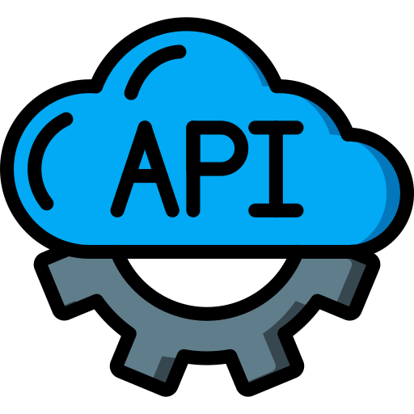

  

  <h1>
    University Software Dev Workshops
  </h1>

## Purpose
Stores my university workshops.

## Workshop Progress
### Epic 4:
- **Workshop 7:**
  - Fake API
  - Wikipedia API
- **Workshop 8:**
  - E1: Simulate Product Viewing and Filtering
  - E2: TFL API for Bus Arrival Times
  - E3: OpenExchangeRates API
  - E4: TinyURL API